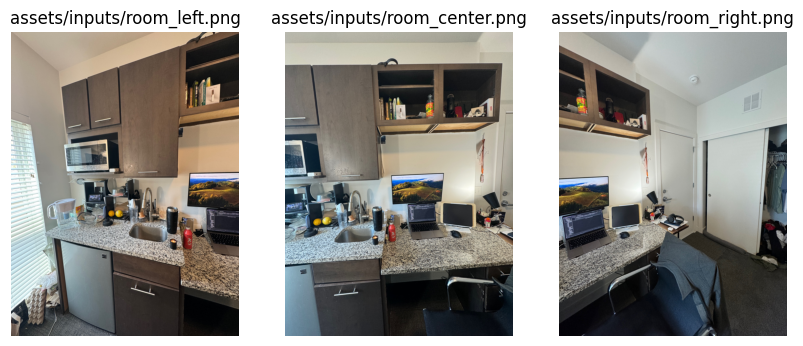

# Image Stitching Project

This is the final project for CSE 5524: Computer Vision for Human-Computer Interaction at The Ohio State University.

## Description

This image stitching application is designed to combine multiple photographic with overlapping fields of view to produce a single larger image, also widely known as a panorama. We will be using SIFT (Scale-Invariant Feature Transform) to detect and match features between images, RANSAC (Random Sample Consensus) to estimate the homography between images, and image warping and blending to combine the images.

## Demo

1. These are the 3 input images to be stitched

    

2. This is the stitched output image

    

3. This is the final result after manually cropping

    

## Installation

1. Clone the repository to your local machine.
2. Navigate to the project directory.
3. Install the required dependencies.

## Usage

1. Add images you wish to stitch to your current directory.
2. Go to `run_app.py` file to load your images and run the file.

## Contributors

- Jason Su [su.925@osu.edu]
- Joe Quinn [quinn.450@osu.edu]
